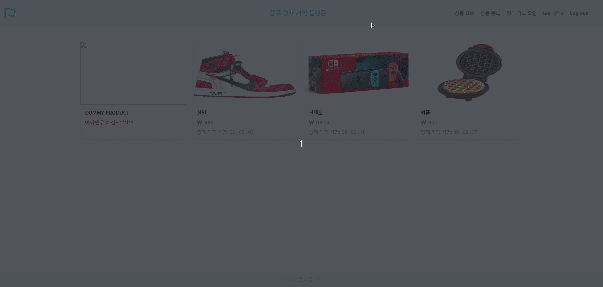
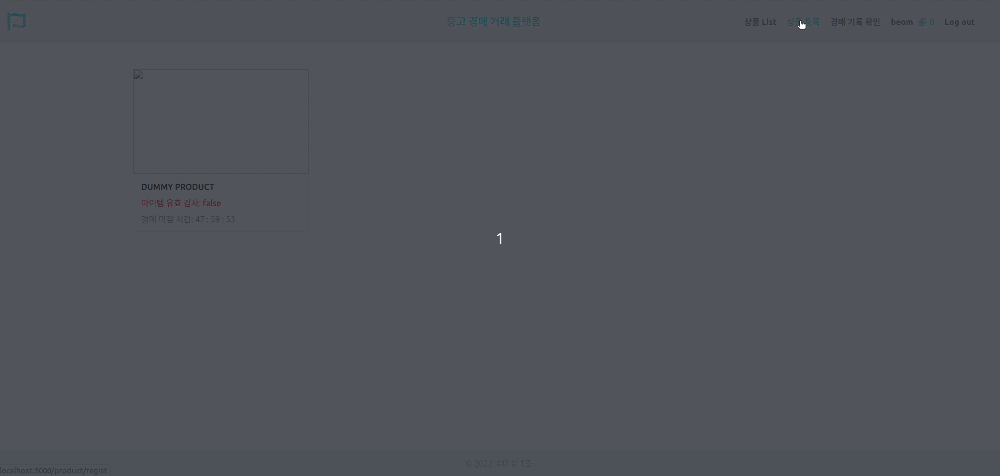
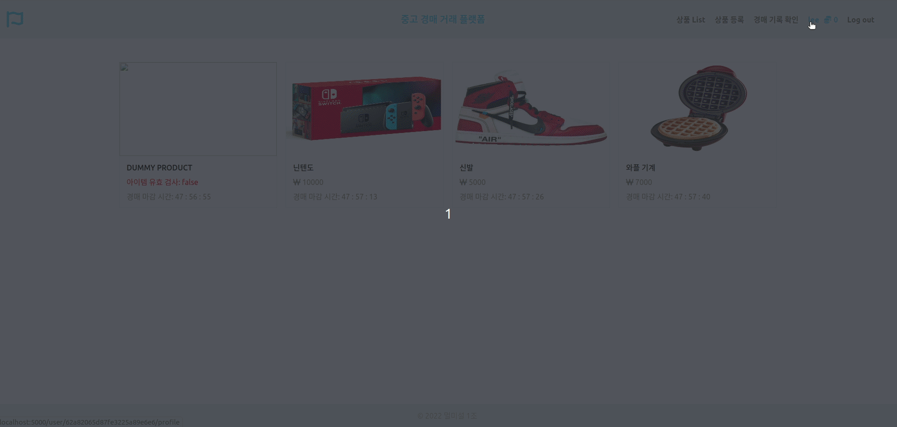
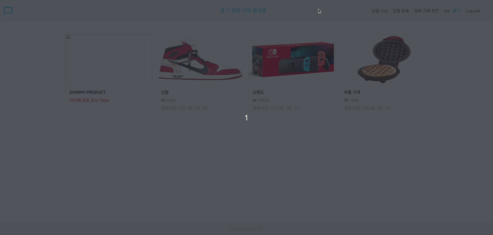

# 중고 경매 거래 사이트

## 목표

기존에 중고 거래에 경매 시스템을 도입하여 사용자들로 하여금 더욱 만족도 높은 거래를 할 수 있도록 하기 위한 플랫폼

## 프로젝트 상세 사항

프로젝트 기간: 2022.03 ~ 2022.06

프로젝트 구성 인원: 4인

프로젝트 내 역할: 프론트 엔드와 백엔드

## 서비스 소개

- 기존 중고 거래의 단점을 보완하기 위해 경매 시스템 도입
  - 소비자와 구매자가 모두 만족할 수 있는 시스템
- 블록체인을 활용
  - 기존 경매에서 문제가 되는 중앙 관리 시스템의 문제를 해결
  - 해킹으로 인한 거래 기록 탈취 및 거래 자체의 과정에서 생길 수 있는 문제를 해결

## UI

### 1) 메인 홈페이지

### 2) 회원가입 및 로그인

### 3) 물품 등록

### 4) 입찰

### 5) 거래

## 사용한 기술 스택

1. Node Js
2. EJS
3. SCSS
4. Mongo DB
